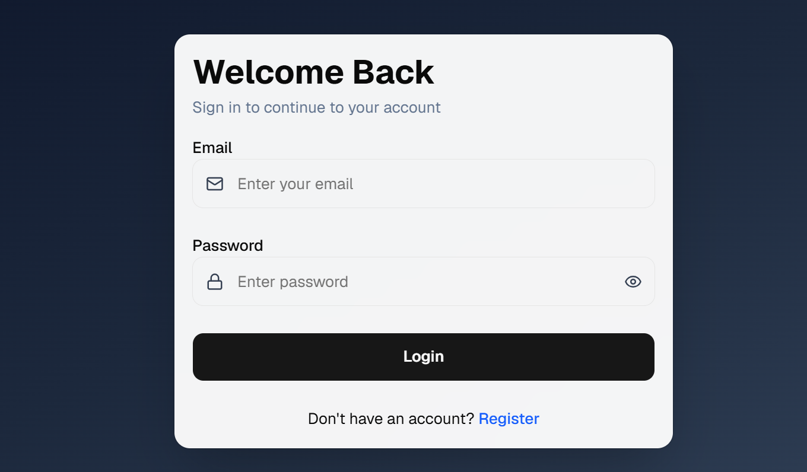
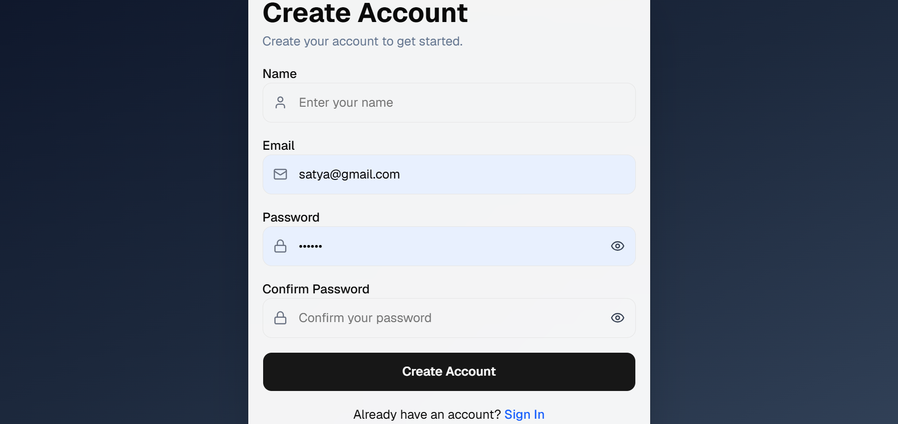
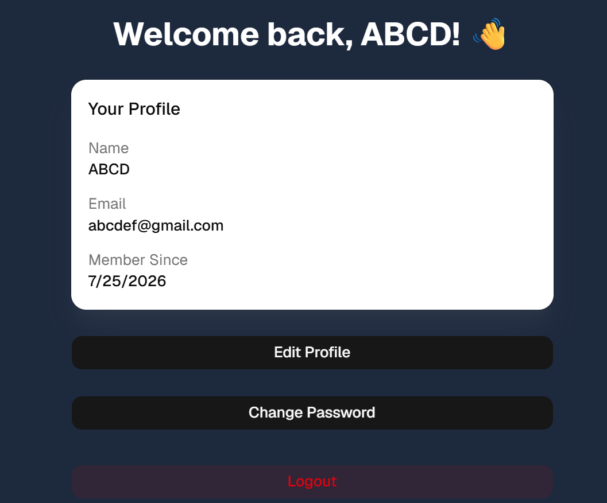
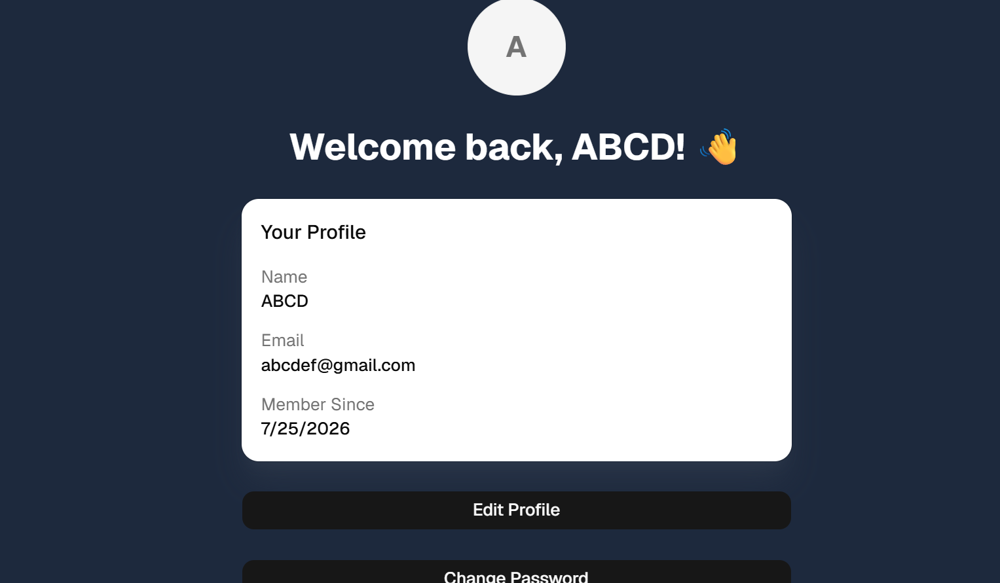

# 🔐 Full Stack Authentication System


A modern full-stack authentication system built using **React**, **Node.js**, **Express.js**, and **MySQL**. This project demonstrates a secure authentication workflow using **JWT Access Tokens**, **Refresh Tokens**, and **HttpOnly Cookies**, along with a clean and responsive user interface built using **Tailwind CSS** and **shadcn/ui**.

The application allows users to register, log in, manage their profile, change their password, and securely access protected routes while following modern authentication and security practices.

---

# ✨ Features

## 🔑 Authentication

- User Registration
- User Login
- JWT Access Token Authentication
- Refresh Token Rotation
- HttpOnly Cookie-based Authentication
- Automatic Access Token Refresh using Axios Interceptors
- Secure Logout

## 👤 User Management

- Protected Dashboard
- View User Profile
- Edit Profile
- Change Password

## 🎨 Frontend

- Responsive UI built with Tailwind CSS
- Reusable UI Components with shadcn/ui
- Skeleton Loading Screens
- Toast Notifications using Sonner
- Loading States for API Requests
- Public and Protected Route Handling

## ⚙️ Backend

- RESTful API Architecture
- MySQL Database Integration
- Password Hashing using bcrypt
- JWT Authentication Middleware
- Request Validation using express-validator
- Modular Project Structure

---

# 🛠️ Tech Stack

## Frontend

- React (Vite)
- React Router DOM
- Tailwind CSS
- shadcn/ui
- Axios
- Sonner

## Backend

- Node.js
- Express.js
- MySQL
- JSON Web Token (JWT)
- bcrypt
- cookie-parser
- express-validator

---

# 📁 Project Structure

```text
Full-Stack-Authentication-System
│
├── frontend
│   ├── public
│   ├── src
│   │   ├── api
│   │   ├── assets
│   │   ├── components
│   │   ├── context
│   │   ├── lib
│   │   └── pages
│   ├── package.json
│   └── vite.config.js
│
├── config
├── controllers
├── middleware
├── routes
├── validators
├── assets
├── server.js
├── package.json
└── README.md
```

---

# 🚀 Getting Started

## Prerequisites

Before running the project, make sure you have:

- Node.js
- MySQL
- npm

## Clone the Repository

```bash
git clone https://github.com/Srineer0204/Full-Stack-Authentication-System.git
cd Full-Stack-Authentication-System
```

---

# ⚙️ Backend Setup

Install backend dependencies:

```bash
npm install
```

Create a `.env` file in the project root:

```env
PORT=5000

DB_HOST=localhost
DB_USER=your_mysql_username
DB_PASSWORD=your_mysql_password
DB_NAME=your_database_name

JWT_SECRET=your_secret_key
JWT_REFRESH_SECRET=your_refresh_secret
```

Start the backend server:

```bash
npm start
```

> If you don't have a `start` script in `package.json`, use:

```bash
node server.js
```

---

# 💻 Frontend Setup

Navigate to the frontend folder:

```bash
cd frontend
```

Install dependencies:

```bash
npm install
```

Start the development server:

```bash
npm run dev
```

The frontend will run on:

```
http://localhost:5173
```

---

# 🔒 Authentication Flow

1. User registers with name, email and password.
2. Password is securely hashed using bcrypt before being stored in MySQL.
3. Upon successful login, the server generates JWT Access and Refresh Tokens.
4. Both tokens are stored securely as HttpOnly Cookies.
5. Protected routes validate the Access Token before granting access.
6. When the Access Token expires, Axios Interceptors automatically request a new Access Token using the Refresh Token.
7. Users can update their profile, change their password, and securely log out.

---

# 📡 API Endpoints

| Method | Endpoint | Description |
|---------|----------|-------------|
| POST | `/api/auth/register` | Register a new user |
| POST | `/api/auth/login` | Authenticate user |
| POST | `/api/auth/refresh` | Refresh Access Token |
| POST | `/api/auth/logout` | Logout user |
| GET | `/api/auth/profile` | Get logged-in user's profile |
| PUT | `/api/auth/profile` | Update user profile |
| PUT | `/api/auth/change-password` | Change user password |

---

# 📸 Screenshots

## Login Page



---

## Register Page



---

## Dashboard



---

## Dashboard Actions



---

# 🌱 Future Improvements

- Email Verification
- Forgot Password
- Password Reset via Email
- Profile Picture Upload
- OAuth Login (Google / GitHub)
- Role-Based Access Control (RBAC)
- Admin Dashboard

---

# 📚 What I Learned

Through this project, I gained hands-on experience with:

- Building RESTful APIs using Express.js
- Implementing secure JWT Authentication
- Managing authentication using HttpOnly Cookies
- Refresh Token Rotation
- React Context API
- Axios Interceptors
- Protected and Public Route Handling
- Tailwind CSS
- shadcn/ui Components
- Form Validation
- MySQL Integration
- Building a complete full-stack authentication workflow

---

# 🤝 Contributing

Contributions, suggestions, and improvements are always welcome. Feel free to fork this repository and submit a pull request.

---

# 📄 License

This project was built for learning, practice, and portfolio purposes.

---

# 👨‍💻 Author

**Srineer B H**

- GitHub: [@Srineer0204](https://github.com/Srineer0204)
